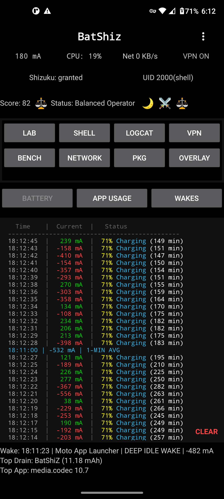
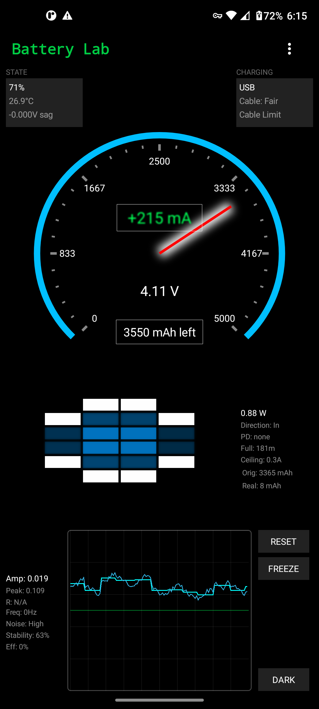
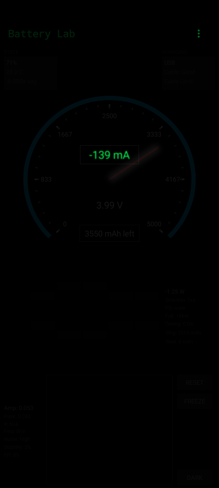
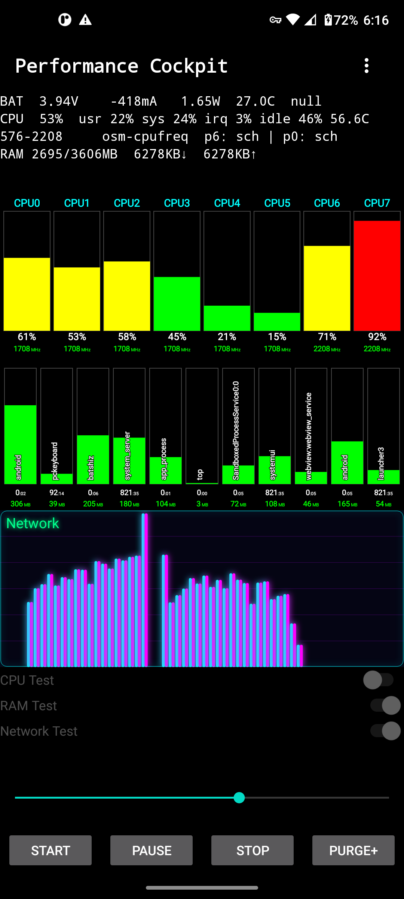
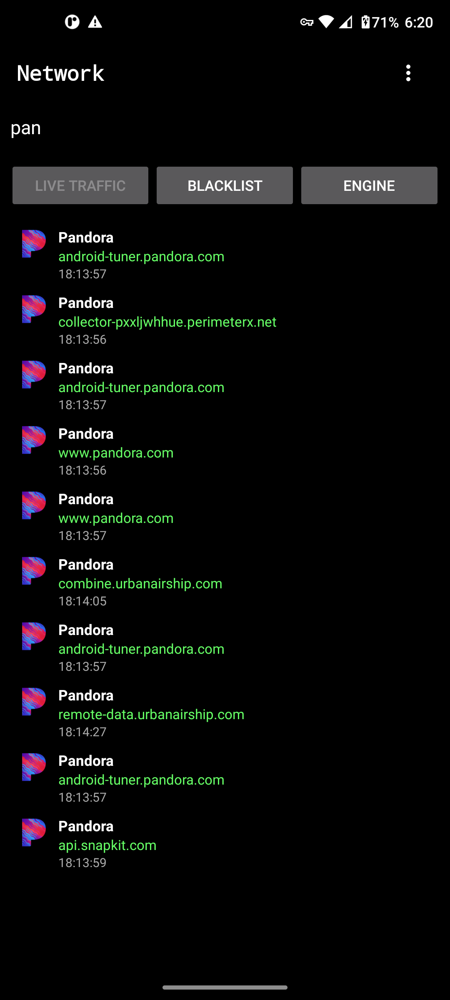
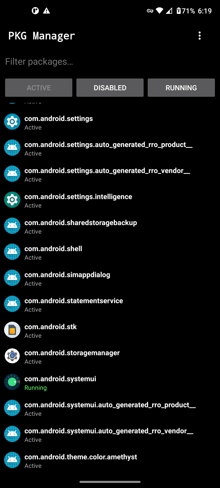
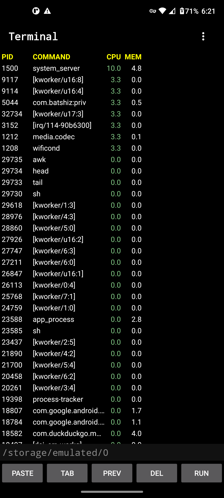
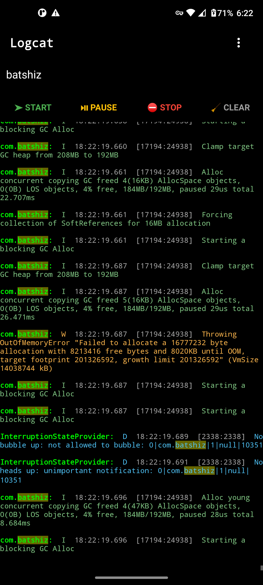

BatShiZ

A Shizuku‑powered Android system utility that gives you real battery, CPU, network, and app‑level control without root.
Fast, clean, and built for people who actually want to see what their device is doing under the hood.
⚡ Features
Battery & System Intelligence

    Battery Lab with real hardware‑level stats

    Coulomb counter for accurate mA drain/charge readings

    Learned ETA system with 3‑stage prediction

    Wake detector to see what’s waking your device

    Lights‑Out Mode for stealth battery testing

    Floating mA overlay to watch drain from anywhere

Performance Tools

    Bench Tester with CPU, RAM, and Network stress modes

    Per‑core CPU graphing

    RAM activity blocks

    Network bandwidth graph

    Purge+ (cache clear, background app kill, dex rebuild)

Network Control

    Full VPN‑based ad/tracker blocking

    Firewall with per‑app network rules

    Network sniffing / monitoring

    App pinning to HTTP engine

(Uses Android’s VPN API — no root, no shady tricks.)
Developer / Power‑User Tools

    Terminal with quick commands

    Colorized Logcat viewer

    Package Manager

        Enable / disable apps

        Kill processes

        Open app info

    App usage + wake tracking

📦 Download

Get the latest APK from the Releases page:

👉 https://github.com/Undz2/BatShiZ/releases

Click Assets to expand if not already open.

Look for the file named:

BatShiZ-(version).apk

The “Source code” files are auto‑generated by GitHub — the APK is the real download.
🛠 Requirements

    Android 8.0+ (API 26+)

    Shizuku (Recommended, NOT required)  
    BatShiZ works without Shizuku, but certain features (package manager, terminal commands, advanced battery reads, Purge+, etc.) unlock when Shizuku is available.

🚀 Setup

    Install Shizuku (optional but recommended)

    Start Shizuku (ADB or root mode)

    Install BatShiZ

    Grant Shizuku permission when prompted

    Open the app and explore

    ## 📸 Screenshots

### Main UI

### Battery Lab

### Bench Tester

### Network Engine / Firewall

### Package Manager

### Terminal & Logcat

❗ Disclaimer

This is an early build.
Battery and system data accuracy depends on your device’s hardware and OEM implementation.
Some features require Shizuku for elevated access.
Use package‑disabling features responsibly.
💬 Questions or Comments

If something breaks, looks weird, or you have ideas:

Email: batshizkrazy@proton.me

## 📄 License
All Rights Reserved. See the LICENSE file for details.

